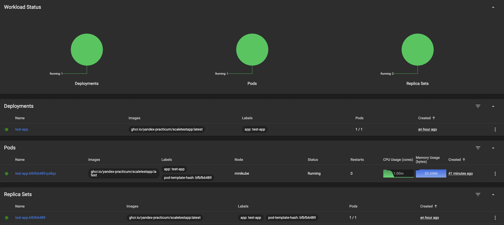
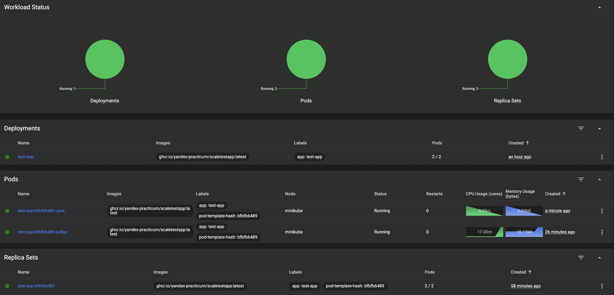
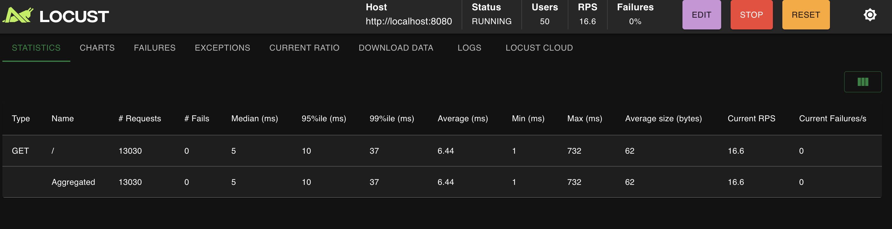

# Task2: Динамическое масштабирование контейнеров

## Выполненные команды и результаты

### 1. Подготовка окружения

```bash
# Запуск Minikube
minikube start
```

**Результат:** Minikube запущен

```bash
# Включение metrics-server
minikube addons enable metrics-server
```

**Результат:** Metrics-server включен

```bash
# Проверка metrics-server
kubectl get pods -n kube-system | grep metrics-server
```

**Результат:**
```
metrics-server-7fbb699795-m7lth    1/1     Running   0             35m
```

### 2. Развертывание приложения

```bash
# Применение манифестов
kubectl apply -f deployment.yaml
kubectl apply -f service.yaml
kubectl apply -f hpa.yaml
```

**Результат:**
```
deployment.apps/test-app created
service/test-app-service created
horizontalpodautoscaler.autoscaling/test-app-hpa created
```

### 3. Проверка развертывания

```bash
# Проверка подов
kubectl get pods
```

**Результат:**
```
NAME                       READY   STATUS    RESTARTS   AGE
test-app-bfbfb6489-6ggtz   1/1     Running   0          20m
```

```bash
# Проверка deployment
kubectl get deployment
```

**Результат:**
```
NAME       READY   UP-TO-DATE   AVAILABLE   AGE
test-app   1/1     1            1           34m
```

```bash
# Проверка сервиса
kubectl get service test-app-service
```

**Результат:**
```
NAME               TYPE           CLUSTER-IP      EXTERNAL-IP   PORT(S)          AGE
test-app-service   LoadBalancer   10.98.191.138   <pending>     8080:30533/TCP   7m11s
```

### 4. Проверка HPA

```bash
# Проверка HPA
kubectl get hpa
```

**Результат:**
```
NAME           REFERENCE             TARGETS           MINPODS   MAXPODS   REPLICAS   AGE
test-app-hpa   Deployment/test-app   memory: 52%/80%   1         10        1          35m
```

```bash
# Детали HPA
kubectl describe hpa test-app-hpa
```

**Результат:**
```
Name:                                                     test-app-hpa
Namespace:                                                default
Reference:                                                Deployment/test-app
Metrics:                                                  ( current / target )
  resource memory on pods  (as a percentage of request):  52% (11091968) / 80%
Min replicas:                                             1
Max replicas:                                             10
Behavior:
  Scale Up:
    Stabilization Window: 60 seconds
    Select Policy: Max
    Policies:
      - Type: Percent  Value: 100  Period: 15 seconds
  Scale Down:
    Stabilization Window: 300 seconds
    Select Policy: Max
    Policies:
      - Type: Percent  Value: 10  Period: 60 seconds
```

### 5. Проверка метрик

```bash
# Метрики подов
kubectl top pods
```

**Результат:**
```
NAME                       CPU(cores)   MEMORY(bytes)   
test-app-bfbfb6489-6ggtz   1m           10Mi            
```

### 6. Тестирование приложения

```bash
# Port-forward для доступа к приложению
kubectl port-forward test-app-bfbfb6489-6ggtz 8080:8080 &
```

**Результат:** Port-forward запущен

```bash
# Тестирование главной страницы
curl http://localhost:8080/
```

**Результат:**
```
Идентификатор пода: test-app-bfbfb6489-6ggtz
```

```bash
# Тестирование метрик
curl http://localhost:8080/metrics
```

**Результат:** Метрики доступны (Prometheus формат)

### 7. Нагрузочное тестирование с Locust

```bash
# Создание locustfile.py
cat > locustfile.py << 'EOF'
from locust import HttpUser, between, task

class WebsiteUser(HttpUser):
    wait_time = between(1, 5)

    @task
    def index(self):
        self.client.get("/")
EOF
```

```bash
# Запуск Locust
locust --host=http://localhost:8080
```

**Результат:**
```
[2025-10-29 01:28:02,848] Mac/INFO/locust.main: Starting Locust 2.42.1
[2025-10-29 01:28:02,851] Mac/INFO/locust.main: Starting web interface at http://0.0.0.0:8089
[2025-10-29 01:28:16,411] Mac/INFO/locust.runners: Ramping to 50 users at a rate of 5.00 per second
[2025-10-29 01:28:25,434] Mac/INFO/locust.runners: All users spawned: {"WebsiteUser": 50} (50 total users)
```

### 8. Мониторинг масштабирования

```bash
# Слежение за HPA
kubectl get hpa -w
```

**Результат:**
```
NAME           REFERENCE             TARGETS           MINPODS   MAXPODS   REPLICAS   AGE
test-app-hpa   Deployment/test-app   memory: 66%/80%   1         10        1          38m
test-app-hpa   Deployment/test-app   memory: 67%/80%   1         10        1          39m
```

### 9. Дашборд Kubernetes

```bash
# Открытие дашборда
minikube dashboard
```

**Результат:** Дашборд открыт (скриншот приложен)

## Скриншоты

### Скриншот 1: Дашборд без нагрузки

- Показывает deployment `test-app` с 1 репликой
- Базовое состояние системы без нагрузки

### Скриншот 2: Автомасштабирование в действии

- Показывает deployment `test-app` с 2 репликами (автомасштабирование сработало)
- Два пода с разным временем создания
- Демонстрирует успешное автомасштабирование HPA в ответ на нагрузку

### Скриншот 3: Locust интерфейс

- 50 пользователей активны
- 16.4 RPS (запросов в секунду)
- 7717 запросов выполнено
- 0% ошибок
- Host: http://localhost:8080

## Файлы задания

- `deployment.yaml` - манифест развертывания с лимитом памяти 30Mi
- `service.yaml` - манифест сервиса для доступа к приложению
- `hpa.yaml` - манифест HPA с масштабированием по памяти (80%, макс. 10 реплик)
- `locustfile.py` - скрипт для нагрузочного тестирования
